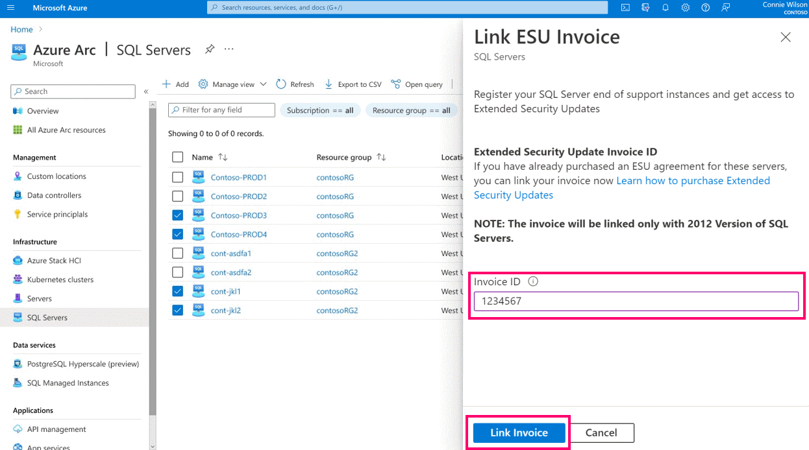
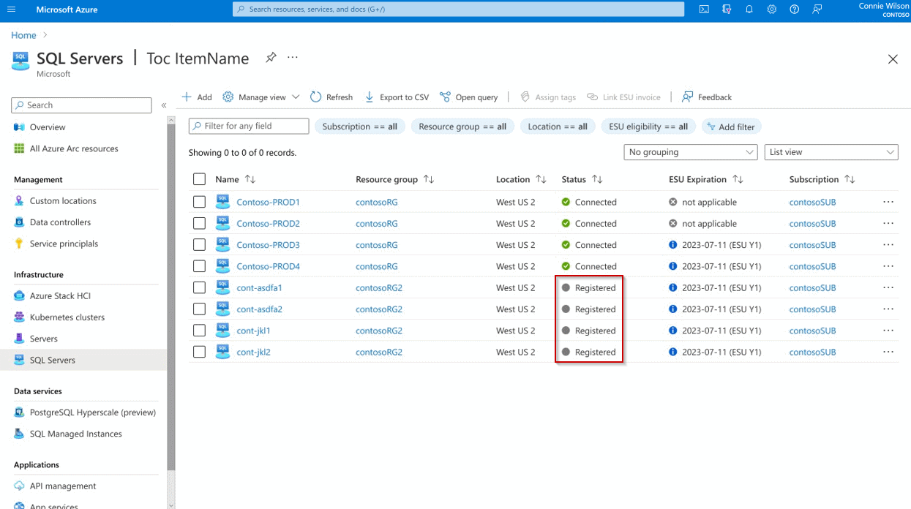
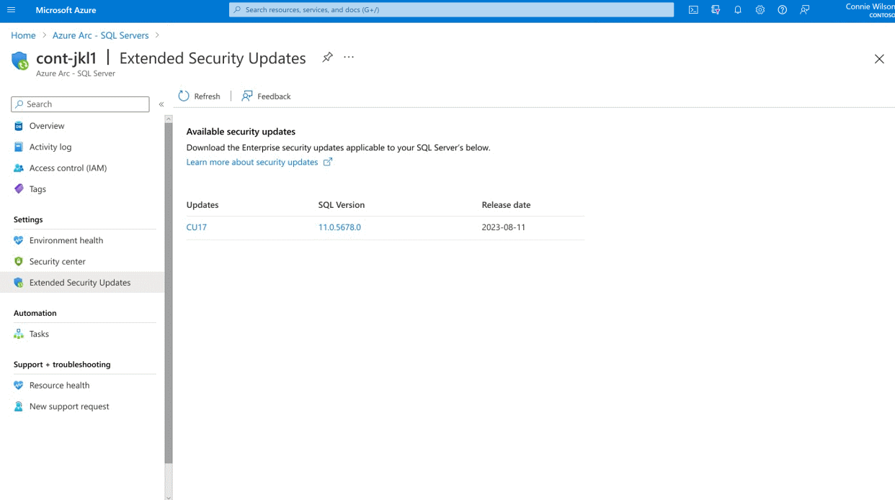
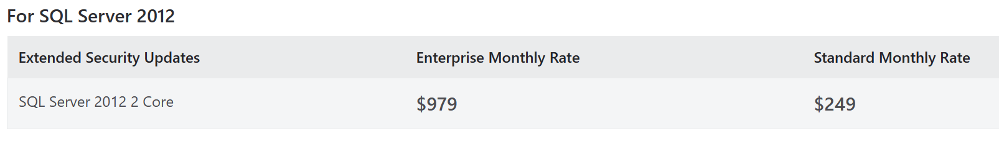
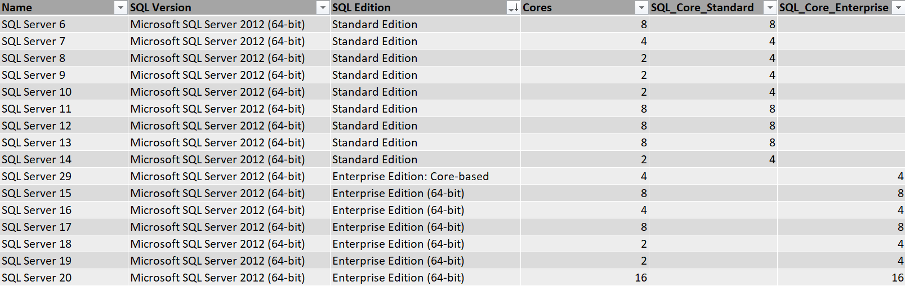
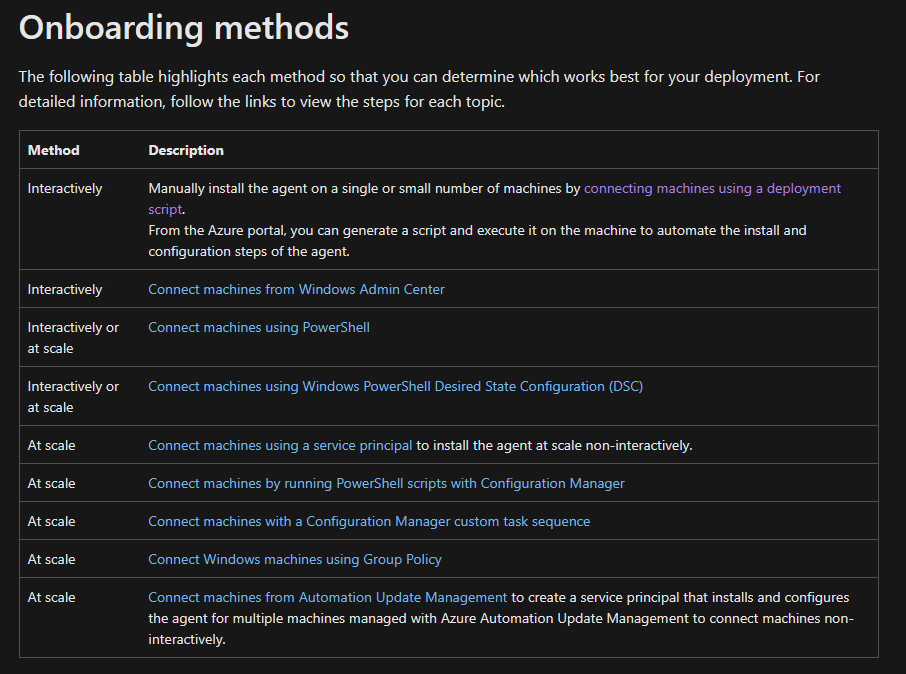
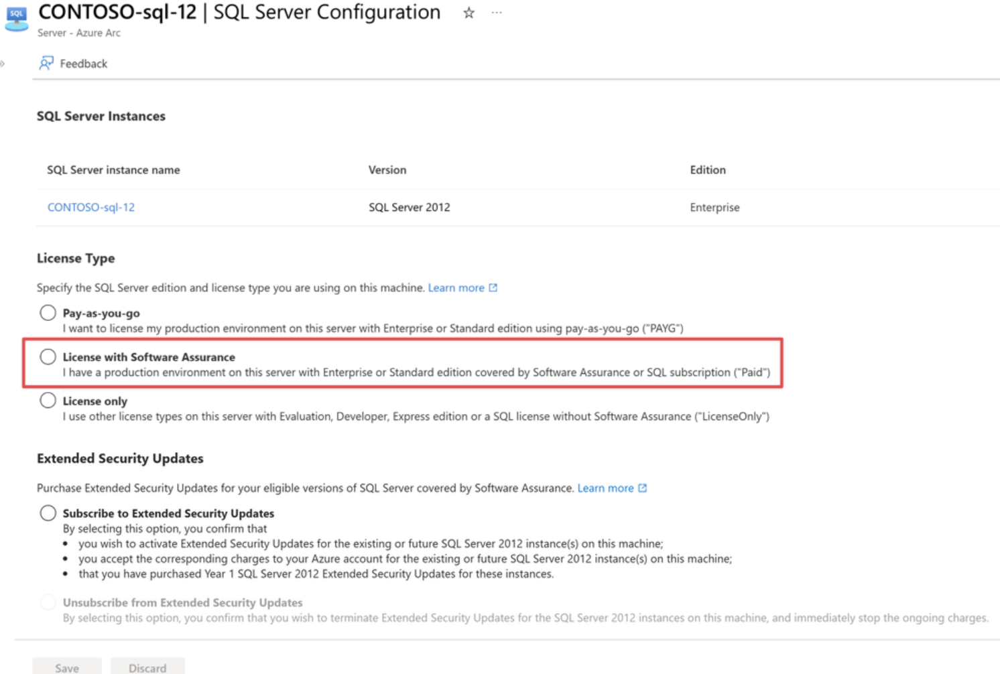
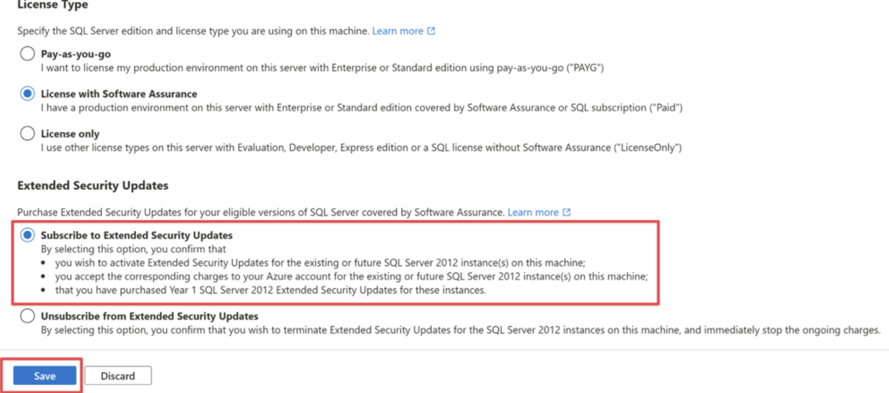

# SQL Server Extended Security Updates (ESU) with Azure Arc
## Summary/TL;DR
How do I provide security updates to SQL Server 2012 and 2014 without upgrading?

You can now purchase SQL Server Extended Security Updates (ESU) through your Azure subscription with the Azure Arc hybrid agent. The pricing is monthly instead of the previous yearly purchase through Volume Licensing (VL). This can lead to substantial cost savings over the traditional VL purchase.

You aren't migrating to Azure. You install the Azure Connected Machine agent on each server. This agent connects your server to the Azure control plane. The agent detects SQL and installs the SQL extension. This allows you to license ESU for the server. Azure Arc is free (unless you enable additional features) but you will pay for ESU licenses. Azure Arc ESU is enabling ESU but doesn't auto apply the updates. Your current update process/tooling does not change.

This is my summary of the conversation after having this same conversation with many customers. I'll share the relevant Azure Docs along the way.

## What are Extended Security Updates, important dates, and options
"The Extended Security Update (ESU) program is a last resort option for customers who need to run certain legacy Microsoft products past the end of support. It includes Critical and/or Important security updates for a maximum of three years after the product's End of Extended Support date."

Product | End of Extended Support/ESU Start Date | ESU End Date Year 1 | ESU End Date Year 2 | ESU End Date Year 3 | Type of Security Update |
-------|--------------------------------------|-------------------|-------------------|-------------------|-----------------------
SQL Server 2012 | July 12, 2022 | July 11, 2023 | July 9, 2024 | July 8, 2025 | Critical
SQL Server 2014 | July 9, 2024 | July 8, 2025 | July 14, 2026 | July 12, 2027 | Critical

The following links provide additional detail. The summary is that SQL Server 2012 reached end of support on July 12, 2022 and SQL Server 2014 reaches end of support on July 9, 2024. In order to continue receiving security updates you must purchase ESU for each SQL server.

You can get access to ESUs through the following options:
* SQL Server on Azure Virtual Machines - ESUs are free and enabled by default.
* SQL Server on-premises or a hosted environment. ESUs are free on the following Azure services:
  * Azure Stack HCI
  * Azure Stack Hub
* **SQL Server on-premises or a hosted environment, and connected to Azure Arc** - You can use Extended Security Updates enabled by Azure Arc to enable ESU as a monthly subscription. The updates can be automatically installed when they're available. You also benefit from the features that SQL Server enabled by Azure Arc provides. If you migrate your SQL Server to Azure or upgrade the subscription, charges then automatically stop. You can cancel the ESU subscription manually at any time.
* SQL Server on-premises or in a hosted environment, and not connected to Azure Arc - You can purchase the ESU SKU through the Volume Licensing Service Center (VLSC), and manually register your SQL Server instances on the Azure portal to receive the patches. For more information, see Register disconnected SQL Server instances for ESUs later in this article.

**Important Note** - To qualify for ESU on-premises or in hosted environments, your server or operating system must meet one of the following prerequisites:

1. Be covered by an active Software Assurance (SA) plan acquired through any program, such as Enterprise Agreement (EA), Enterprise Agreement Subscription (EAS), Server & Cloud Enrollment (SCE), or Enrollment for Education Solutions (EES).
2. Have active subscription licenses acquired through any program, including Cloud Solution Provider (CSP).
3. Have been acquired as 'License-Included' services through a Service Provider License Agreement (SPLA) partner.

### Additional resources:
[Eligibility Criteria (Software Assurance)](https://learn.microsoft.com/en-US/lifecycle/faq/extended-security-updates#esu-for-windows-and-sql-server)

[Lifecycle FAQ - Extended Security Updates](https://learn.microsoft.com/en-us/lifecycle/faq/extended-security-updates)

[SQL Server enabled by Azure Arc supports Extended Security Updates](https://learn.microsoft.com/en-us/sql/sql-server/azure-arc/extended-security-updates?view=sql-server-ver16)

[What are Extended Security Updates for SQL Server?](https://learn.microsoft.com/en-us/sql/sql-server/end-of-support/sql-server-extended-security-updates?view=sql-server-ver16&tabs=portal)

## Why enable ESU with Azure Arc?

ESU enabled by Azure Arc was announced in July of 2023. This allows customers to deploy the Azure Arc agent on their servers to enable ESU instead of managing and deploying activation keys. The link below goes into all benefits but I'll highlight two key benefits:

1. Pay as you Go (PAYG) billing - You previously paid for ESU 1 year at a time. If you decommissioned or upgraded the server after 3 months you were stuck with the fixed cost of 12 months. Arc ESU enables monthly billing. Now when you decommission or upgrade a server after 3 months you can stop billing to reduce your ESU costs.
2. Azure Billing - The monthly Arc ESU costs are billed against your Azure subscription. This allows you to monitor your ESU spend and work with your application teams to optimize their cloud spend (showback/chargeback). It also counts towards your Microsoft Azure Consumption Commitment (MACC).

### Additional Resources
[New options for Extended Security Updates enabled by Azure Arc](https://techcommunity.microsoft.com/t5/azure-arc-blog/new-options-for-extended-security-updates-enabled-by-azure-arc/bc-p/3886088)

## Licensing guidelines and pricing
For SQL Server covered by ESUs enabled Azure Arc, the licensing is based on the number of cores. If you have multiple servers, you'll need to pay for all the cores used across those servers. We're in the middle of SQL 2012 ESU period. I'll include 2012 specific guidance since there are cost implications for enabling ESU mid-cycle.

Guidelines not specific to SQL version:
* Core minimums - There is a 4-core minimum per server. You can't bundle multiple servers to hit the 4-core minimum.
* Match license type - Arc SQL ESU license type must match the license type/edition of the on-prem SQL instance. Enterprise or Standard.
* Back-billing - For customers who enroll in ESUs enabled by Azure Arc after the end of support dates, they will be billed a one-time upfront charge for the months they missed after the end of support date, with billing coming in at the end of the month.
    * This also includes any gaps in coverage. E.g., Enabling for month 1, disabling for month 2 and 3, before re-enabling in month 4. You will be back-billed for months 2 and 3. 

Guidelines specific to SQL 2012:
* Year 1 ESU with VL - Before you can use Extended Security Updates enabled by Azure Arc for SQL Server 2012, you must first acquire the Year 1 Extended Security Updates SKU through Commercial Licensing. See link in Additional Resources section for more details.
* What do I need to do if I didn't purchase Year 1 ESU through VL? What are the cost implications?:
    * You will need to purchase Year 1 VL and ensure you have software assurance (or other qualifications listed above.) Then you can enable Arc SQL ESU. Since we're in the middle of Year 2, you will be back-billed to July 2023 to pay the coverage gap in Year 2.

Guidelines specific to Disconnected SQL servers: 
* VL Invoice Registration - If you've already purchased ESU VL, the ESU invoice for your VL purchase will need to be registered in the Azure portal. Then you can link this invoice to your disconnected (but registered) SQL server.

* Register disconnected servers in Azure portal - Yes, disconnected servers are supported. You register them in the Azure portal, one at a time or in bulk, so they can receive ESU updates. 

* Manually download updates - Disconnected servers won't have access to automatically download updates from Windows Update. You will open the disconnected SQL server resource in Azure, select Extended Security Updates, and manually download the update to install offline.

Arc SQL ESU pricing is available at the link in the additional resources section below. Here is a screenshot from the pricing page that shows the cost of a 2 core pack.

### Identify core counts
Now you need to identify your required cores. You'll need this to accurately price out ESU costs for your environment. I'm including a simple example spreadsheet in the example folder. It includes formulas in the last two columns to set the core minimum counts for Enterprise or Standard edition.

Update the following columns to determine your required cores (Standard or Enterprise):
* Per server core counts - Server name, SQL version, SQL edition, total cores 

### Additional Resources
[Azure Arc back-billing](https://learn.microsoft.com/en-us/lifecycle/faq/extended-security-updates#back-billing-for-sign-ups-after-the-end-of-support-dates)

[Extended Security Updates enabled by Azure Arc Pricing](https://azure.microsoft.com/en-us/pricing/details/azure-arc/core-control-plane/)

[Licensing ESU through commercial licensing](https://learn.microsoft.com/en-US/lifecycle/faq/extended-security-updates#licensing-with-extended-security-updates-licenses--skus--through-commercial-licensing)

[SQL ESU FAQ](https://learn.microsoft.com/en-us/sql/sql-server/end-of-support/extended-security-updates-frequently-asked-questions?view=sql-server-ver15)

[SQL ESU licensing requirements](https://learn.microsoft.com/en-US/lifecycle/faq/extended-security-updates#for-sql-server)

## Deploy Azure Arc and configure Arc ESU licenses
I'm not going to re-hash the Azure Arc deployment as there are many options and it's dependent on your environment. It's well documented in the docs below. Here are the high-level next steps to deploy Azure Arc and configure Arc SQL ESU:

1. Review Azure Connected Machine agent (Arc agent) deployment options and select one that fits your environment. Deploy Arc.

2. Enable Arc SQL ESU for each SQL instance
  * Set license type to SA
    
  * Set ESU to subscribe
    

This is the simplest example that might be applicable for SQL 2014. A more complex example would be SQL 2012 (mid ESU cycle) with existing VL and disconnected servers. This scenario would have a few more steps:

1. Purchase VL for Year 1 (and SA) if you don't already have it.
2. Register VL invoice in Azure portal. 
3. Deploy Arc Connected Machine agent to all SQL 2012 servers (except disconnected servers).
4. Register disconnected servers in Azure portal.
5. Link relevant VL Invoices to disconnected (registered) servers.
6. Enable Arc SQL ESU for connected servers.

### Additional Resources
[Arc agent deployment options](https://learn.microsoft.com/en-us/azure/azure-arc/servers/deployment-options)

[Enable Arc SQL ESU](https://learn.microsoft.com/en-us/sql/sql-server/end-of-support/sql-server-extended-security-updates?view=sql-server-ver15&preserve-view=true&tabs=portal#subscribe-to-extended-security-updates-enabled-by-azure-arc)

[Link ESU VL Invoice](https://learn.microsoft.com/en-us/sql/sql-server/end-of-support/sql-server-extended-security-updates?view=sql-server-ver15&preserve-view=true&tabs=portal#link-esu-invoice)

[Manually Download ESUs for disconnected servers](https://learn.microsoft.com/en-us/sql/sql-server/end-of-support/sql-server-extended-security-updates?view=sql-server-ver15&preserve-view=true&tabs=portal#download-esus)

[Register disconnected SQL Servers in Azure portal](https://learn.microsoft.com/en-us/sql/sql-server/end-of-support/sql-server-extended-security-updates?view=sql-server-ver15&preserve-view=true&tabs=portal#register-instances-on-azure-portal)

[Register ESU VL in Azure portal](https://learn.microsoft.com/en-us/sql/sql-server/end-of-support/sql-server-extended-security-updates?view=sql-server-ver15&preserve-view=true&tabs=portal#register-instances-for-esus)