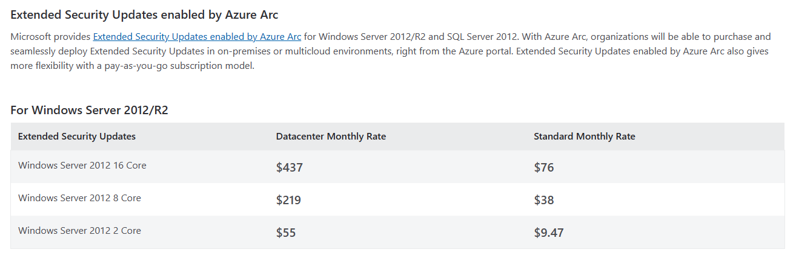
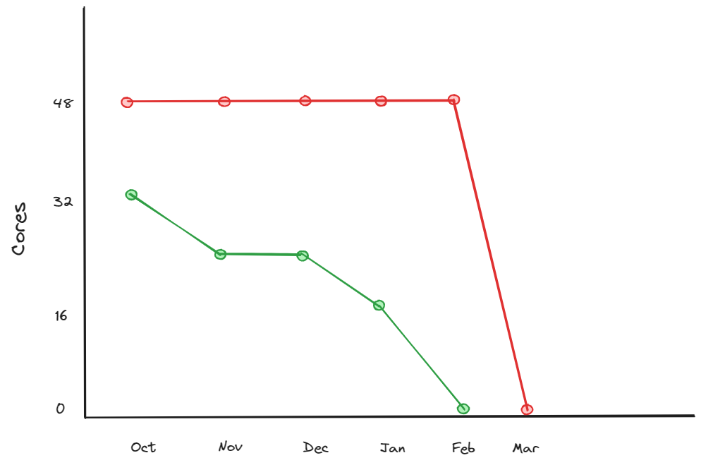
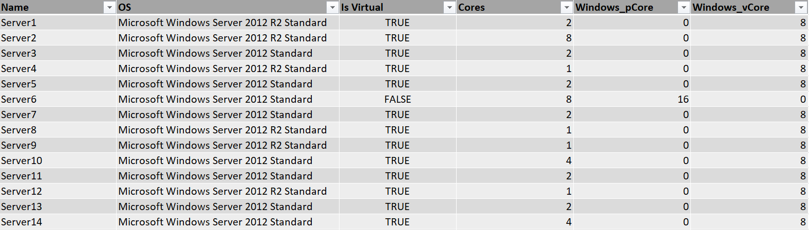
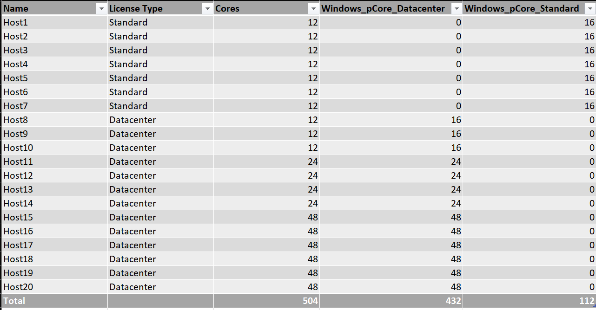
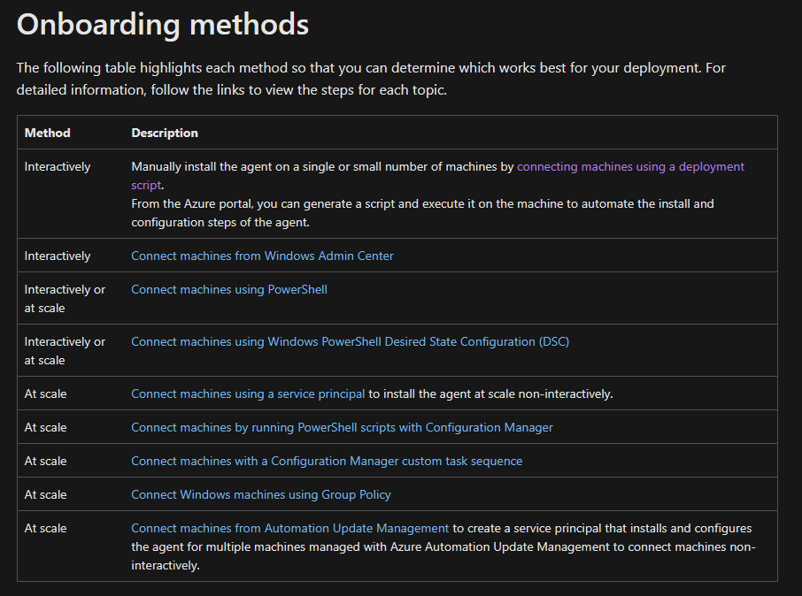

# Windows Server Extended Security Updates (ESU) with Azure Arc
## Summary/TL;DR
You can now purchase Windows Server Extended Security Updates (ESU) through your Azure subscription with the Azure Arc hybrid agent. The pricing is monthly instead of the previous yearly purchase through Volume Licensing (VL). There is also flexiblity in how you license virtual and physical servers which can lead to substantial cost savings over the traditional VL purchase.

You aren't migrating to Azure. You install the Azure Connected Machine agent on each server. This agent connects your server to the Azure control plane. This allows you to license ESU for the server. Azure Arc is free (unless you enable additional features) but you will pay for ESU licenses. Azure Arc ESU is enabling ESU but doesn't supply the updates. Your existing update process will remain unchanged.

This is my summary of the conversation after having this same conversation with many customers. I'll share the relevant Azure Docs along the way.

## What are Extended Security Updates, important dates, and options
"The Extended Security Update (ESU) program is a last resort option for customers who need to run certain legacy Microsoft products past the end of support. It includes Critical and/or Important security updates for a maximum of three years after the product's End of Extended Support date."

Product | End of Extended Support/ESU Start Date | ESU End Date Year 1 | ESU End Date Year 2 | ESU End Date Year 3 | Type of Security Update |
-------|--------------------------------------|-------------------|-------------------|-------------------|-----------------------
Windows Server 2012/R2 | October 10, 2023 | October 8, 2024 | October 14, 2025 | October 13, 2026 | Critical, Important

The following links provide additional detail. The summary is that Windows Server 2012/R2 reached end of support on October 10, 2023. In order to continue receiving security updates you must purchase ESU for each 2012 server. 

You can get access to ESUs through the following options:
* Azure virtual machines - Applicable virtual machines (VMs) hosted in Azure are automatically enabled for ESUs and these updates are provided free of charge, there's no need to deploy a MAK or take any other action. See [Extended Security Updates on Azure](https://learn.microsoft.com/en-us/windows-server/get-started/extended-security-updates-deploy#extended-security-updates-on-azure) to learn more.
* **Azure Arc-enabled Servers** - If your servers are on-premises or in a hosted environment, you can enroll your Windows Server 2012 and 2012 R2 or SQL Server 2012 machines for Extended Security Updates via the Azure portal, connect through Azure Arc, and you'll be billed monthly via your Azure subscription.
* Non-Azure servers without Azure Arc - If you can't connect using Azure Arc, use Extended Security Updates on non-Azure VMs, by using a Multiple Activation Key (MAK) and applying it to the relevant servers. This MAK lets the Windows Update servers know that you can continue to receive security updates.

**Important Note** - Software Assurance (SA) is required before you can enable ESU. During the ESU enablement process you will need to attest to having SA.

### Additional resources:
[Lifecycle FAQ - Extended Security Updates](https://learn.microsoft.com/en-us/lifecycle/faq/extended-security-updates)

[How to get Extended Security Updates (ESU) for Windows Server](https://learn.microsoft.com/en-us/windows-server/get-started/extended-security-updates-deploy)

## Why enable ESU with Azure Arc?

ESU enabled by Azure Arc was announced in July of 2023. This allows customers to deploy the Azure Arc agent on their servers to enable ESU instead of managing and deploying activation keys. The link below goes into all benefits but I'll highlight three key benefits:

1. Pay as you Go (PAYG) billing - You previously paid for ESU 1 year at a time. If you decommissioned or upgraded the server after 3 months you were stuck with the fixed cost of 12 months. Arc ESU enables monthly billing. Now when you decommission or upgrade a server after 3 months you can stop billing to reduce your ESU costs.
    * This depends on how you license with ESU. More on that in the next section. 
2. License flexibility - With traditional VL ESU there is a requirement to match ESU licensing to Windows OS licensing. This is not a requirement for Arc ESU. This allows you to purchase ESU for a subset of your virtual machines instead of licensing the entire hypervisor host. This could lead to substanial cost savings when paired with PAYG pricing and a strategy for removing 2012 from the environment. More on this in the next section.
3. Azure Billing - The monthly Arc ESU costs are billed against your Azure subscription. This allows you to monitor your ESU spend and work with your application teams to optimize their cloud spend (showback/chargeback). It also counts towards your Microsoft Azure Consumption Commitment (MACC).

### Additional resources:
[New options for Extended Security Updates enabled by Azure Arc](https://techcommunity.microsoft.com/t5/azure-arc-blog/new-options-for-extended-security-updates-enabled-by-azure-arc/bc-p/3886088)

## Licensing guidelines and pricing

I mentioned license flexiblity in the previous section. Windows licensing AND the difference with Arc ESU can make this confusing. There are a few things to keep in mind.

* Core Type - You will select physical core or virtual core:
  * Physical core (pcore) - Use pcore for physical servers and hypervisor hosts. 
    * **Important note** - pcore has a 16 core minimum per server. If your physical server has less than 16 cores you still need to purchase a minimum of 16 cores to enable ESU for this server.
  * Virtual core (vcore) - Use vcore for virtual servers.
    * **Important note** - vcore has an 8 core minimum per server. If your virtual server has less than 8 cores you still need to purchase a minimum of 8 cores to enable ESU for this server. No, you can't combine eight 1 core VMs into a single license.
* License type - You will select Datacenter or Standard
  * OS license vs ESU license - The Arc ESU license does not need to match the original OS license. E.g., you can license a VM with ESU standard vcore licensing even if it was originally licensed with Datacenter via your host. 
  * Datacenter - You'll select datacenter if you intend to license physical cores (pcores) for a hypervisor host. This will provide ESU for the VMs running on the host.
  * Standard - Standard is selected for VMs (vcore) and physical servers (pcore). 
* Free Dev/Test or DR licenses (link below) - "There are some scenarios in which you may be eligible to receive Extended Security Updates patches at no additional cost. Two of these scenarios supported by Azure Arc include the following":
    * Dev/Test (Visual Studio/MSDN licenses)
    * Disaster Recovery (Entitled benefit DR instances from Software Assurance or subscription only)

Arc ESU pricing is available at the link in the additional resources section below. You can see there is a large cost difference between Datacenter and Standard pricing. It's important to consider your hypervisor density, and 2012 decommissioning plans, when considering how to license ESU in your environment.  

Example - Licensing hypervisor host vs individual servers
* Context - You have a hypervisor host with 48 physical cores. You have 4 2012 servers running on this host that are below the 8 core minimum per server. You have a decommission plan in place to remove the 2012 servers over the next 6 months.
* License hypervisor host (RED) - In this scenario you are licening the host with Datacenter ESU licensing (separate from Windows OS licensing) to cover all VMs running on the host. You must fully license the phsyical cores until all 2012 VMs are removed. Then you can remove the ESU license at the end of February.
    * This still requires installing the Azure Arc agent on all VMs. You don't install Arc on the hypervisor host (unless it's Hyper-V and you're protecting it as well.)
* License per server (GREEN) - In this scenario you are licensing per server with Standard ESU licensing (separate from Windows OS licensing) to cover each VM individually. You can remove each ESU license (or reduce core count if using a single large license) as you decommission a 2012 server. You immediately save on ESU costs.
* October cost comparison
  * License hypervisor host (RED) - 48 Datacenter cores = $1,311
  * License per server (GREEN) - 32 Standard cores = $151.52
* Total cost over 6 months
  * License hypervisor host (RED) - $7,866
  * License per server (GREEN) - $454.56

### Identify core counts
Now you need to identify your required cores. You'll need this to accurately price out ESU costs for your environment. I'm including a simple example spreadsheet in the example folder. It includes formulas in the last two columns to set the core minimum counts for virtual and phsyical cores. 

Update the following columns to determine your required cores (server, host, or combiation):
* Per server core counts - Server name, OS, Virtual (true/false), total cores 

* Per host core counts - Host name, License type (datacenter or standard), total physical cores

### Additional resources:
[License provisioning guidelines for Extended Security Updates for Windows Server 2012](https://learn.microsoft.com/en-us/azure/azure-arc/servers/license-extended-security-updates)

[Extended Security Updates enabled by Azure Arc Pricing](https://azure.microsoft.com/en-us/pricing/details/azure-arc/core-control-plane/)

[Dev/Test scenarios](https://learn.microsoft.com/en-us/azure/azure-arc/servers/deliver-extended-security-updates#additional-scenarios)

## Deploy Azure Arc and configure Arc ESU licenses
I'm not going to re-hash deployment as there are many options and it's dependent on your environment. It's well documented in the docs below.Here are the high-level next steps to deploy Azure Arc and configure Arc ESU:

1. Review Azure Connected Machine agent (Arc agent) deployment options and select one that fits your environment.

2. Create and configure Arc ESU licenses. This can be accomplished in the portal or programmatically.
3. Link Arc-enabled Server (your server with Arc agent) to an ESU license. This will enable the ability to find and install ESU updates.
    * This is also the point where billing starts. Billing begins when you link the first server to the license.

* **Important Note** - Each server must have a servicing stack update (SSU) and a licensing preparation package installed before they can find ESU with windows update.  This link [here](https://support.microsoft.com/en-us/topic/kb5031043-procedure-to-continue-receiving-security-updates-after-extended-support-has-ended-on-october-10-2023-c1a20132-e34c-402d-96ca-1e785ed51d45) describes the pre-reqs. I'll also include this in the Additional Resources section.

How do I structure my vcore ESU licenses? Great question. There are two schools of thought:
1. Single large vcore license - Some customers prefer this approach because it's less work up front. They create a single license and link all of their VMs to this license. The downside would be this makes cost optimization harder once you begin decommissioning 2012 servers. 
2. Single ESU license per VM - This is more work up front but can be programmatically rolled out to ease that burden. This allows you better options for monitoring ESU license usage (orphans) and it's easier to clean up licenses after you remove a 2012 server. This would make it easier to optimize costs along the way.

### Additional Resources
[Arc agent deployment options](https://learn.microsoft.com/en-us/azure/azure-arc/servers/deployment-options)
[ESU server pre-reqs](https://support.microsoft.com/en-us/topic/kb5031043-procedure-to-continue-receiving-security-updates-after-extended-support-has-ended-on-october-10-2023-c1a20132-e34c-402d-96ca-1e785ed51d45)

[Prepare to deliver ESU](https://learn.microsoft.com/en-us/azure/azure-arc/servers/prepare-extended-security-updates?tabs=azure-cloud)

[Deliver ESU - License management](https://learn.microsoft.com/en-us/azure/azure-arc/servers/deliver-extended-security-updates)

[Programmatically manage ESU licenses via API](https://learn.microsoft.com/en-us/azure/azure-arc/servers/api-extended-security-updates)

[PowerShell scripts for ESU license deployment](https://github.com/EverAzureRest/ESUScripts)