# How to size an Azure Virtual Machine
## Selecting the right VM SKU for production.

Let’s say you need a new VM in Azure. This new VM is for a small re-deployment or a net new build. This is not a large-scale migration so you will not be using migration tools for assessing VM size. How do you pick the right size?  Do you match the CPU/memory currently configured on-prem?  Do you follow the size recommendation from the vendor? This should be easy, right? 

The first step is understanding that Azure Virtual Machines come in pre-packaged sizes or SKUs ([Azure VM SKUs](https://docs.microsoft.com/en-us/azure/virtual-machines/sizes)). You do not freely assign CPU and Memory like you would in your hypervisor of choice. The SKUs come in different CPU-to-memory ratios and Azure does sort the SKU types into different categories. You can see in the screenshot below that a General purpose SKU would work for a web server with low to medium traffic. Memory optimized would be a better fit for a relational database. After you identify a category you will need to select a SKU size.

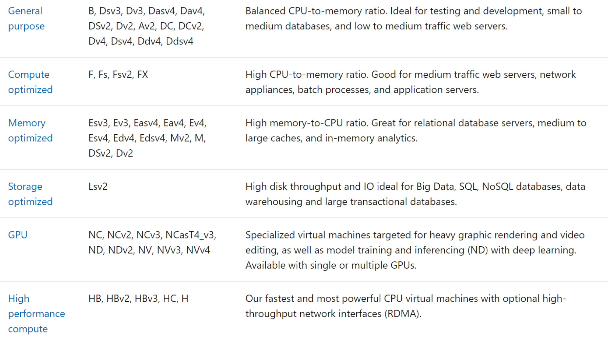

Many customers start by following 'like for like' for CPU/memory from their on-prem environment. This works for most situations and can reduce the time to migrate an environment. However, it can lead to high costs if resources in the environment were overprovisioned or overcommitted. This is also making some assumptions that the storage and networking behind the SKU size will fit every scenario. Likewise, I have seen some vendors only provide CPU and memory specs for their software/appliance. They may not make a cloud specific recommendation at all. 

The risk with this approach is potential performance issues. You could be focusing on CPU/memory because you didn't think about storage performance much on-prem. All you needed to know was your storage capacity needs and the storage admin took care of the performance. CSAs, and support, see customers struggling with performance when they don't properly understand their storage performance requirements. This is especially true for highly utilized databases.

Ok, so you want to investigate this more beyond following 'like for like', now what?

## Gather Performance requirements
Start by gathering the relevant performance requirements: CPU, memory, storage capacity, storage IOPS, storage throughput, and network bandwidth. For existing systems, it would be best to review data for at least 31 days to ensure you capture all the relevant performance peaks. For vendors, you are at their mercy but try to identify as many of the requirements as you can. The worst-case scenario is you are making an educated guess (we can talk about monitoring later.)

Armed with the performance requirements you can begin to identify VM SKUs that meet your needs. The Azure VM Docs, referenced in the first section, have tables with each VM SKU and the associated limits. This is the end of the story for smaller or lightly used VMs. You can find a CPU/memory ratio that meets your needs without much trouble. There is a distinction that is important to understand when your VM has higher storage performance requirements.

Virtual Machines and Managed Disks have separate storage level limits. You will see throttling once you hit one of these limits. What does this mean?

## VM and Disk level storage limits

When reviewing VM SKUs in Azure Docs you will notice they have limits for cached and uncached storage performance (e.g. [Dsv3-Series](https://docs.microsoft.com/en-us/azure/virtual-machines/dv3-dsv3-series#dsv3-series)). This is the max IOPS and throughput you can achieve with this VM SKU. This is not including the bursting capability which I will not go into in this post. These VM level limits are separate from the Managed Disks IOPS, and throughput limits, you will see in storage documentation (e.g. [Premium limits](https://docs.microsoft.com/en-us/azure/virtual-machines/disks-types#premium-ssd)). Here are screenshots of each for reference:

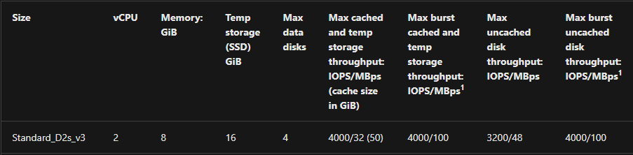

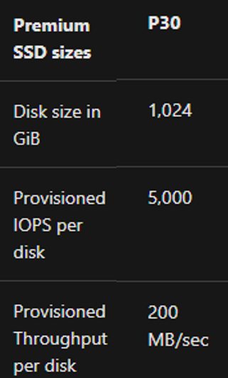 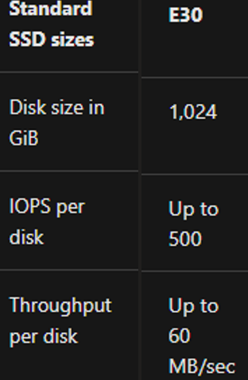

These limits are applied across three different levels. You can see in the diagrams below how the cached and uncached levels are applied. Here is a description from the [documentation](https://docs.microsoft.com/en-us/azure/virtual-machines/managed-disks-overview#disk-allocation-and-performance):

>"The first level provisioning sets the per-disk IOPS and bandwidth assignment. At the second level, compute server host implements SSD provisioning, applying it only to data that is stored on the server's SSD, which includes disks with caching (ReadWrite and ReadOnly) as well as local and temp disks. Finally, VM network provisioning takes place at the third level for any I/O that the compute host sends to Azure Storage's backend. With this scheme, the performance of a VM depends on a variety of factors, from how the VM uses the local SSD, to the number of disks attached, as well as the performance and caching type of the disks it has attached."

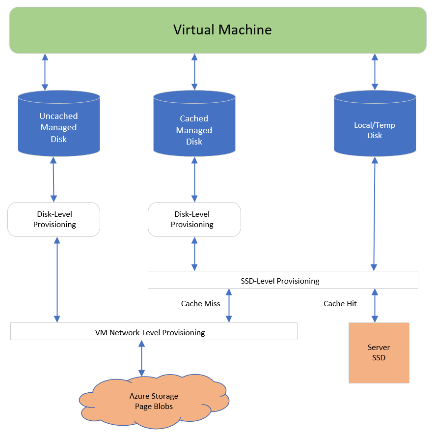

We can apply a VM SKU and Disk size to this diagram to visualize the limits. Here we can see that even though the Managed Disk size has 5,000 IOPS we would be capped by the VM Network-Level provisioning or the SSD-Level provisioning.

I think it would be helpful to see two examples of how this could play out in your environment.

### Example of Disk IO Capping

Setup
-   Standard_D2s_v3
    -   Uncached IOPS: 3,200
-   E30 OS disk
    -   IOPS: 500
-   Two E30 data disks × 2
    -   IOPS: 500

We can use the setup above to demonstrate Disk IO capping. The VM has an uncached IOPS limit of 3,200 but each VM is limited to 500 IOPS. An application generating 3,000 IOPS would be within the VM level limit of 3,200. However, each disk in this scenario is capped at 500 IOPS. The overage would be throttled by Azure and increase your disk queue depth.

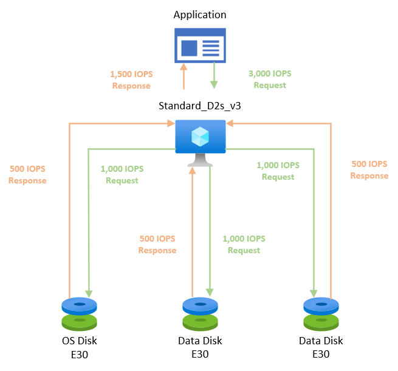
### Example of VM IO Capping

Setup
-   Standard_D2s_v3
    -   Uncached IOPS: 3,200
-   P30 OS disk
    -   IOPS: 5,000
-   Two P30 data disks × 2
    -   IOPS: 5,000

This example will flip the previous scenario to demonstrate VM IO capping. We have changed the disk size in our setup to accommodate an increased IO demand (15,000 IOPS) from the application. The new disks are P30 premium disks with an IOPS limit of 5,000. Since the 15,000 is over the VM level limit of 3,200 IOPS the request will be throttled by Azure and again increase your disk queue depth.
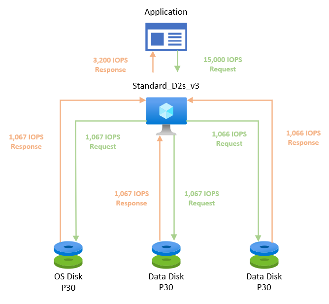

Hopefully, this demonstrates why it is important to keep these limits in mind when selecting a VM and Disk combination. The VM will need to meet your storage performance requirements in addition to the CPU and memory requirements. Stripping disks to achieve 100K IOPS won't matter if the VM is limited to 5k IOPS.

## You've picked a size. Now what? Monitoring!
Remember, in our scenario you are not 100% confident in your performance requirements. While you should always monitor your system performance it is even more important in this situation. You will want to validate that your storage performance assumptions were correct, and you have room to grow in production. 

At a minimum, you can use Azure Monitor Metrics to monitor the performance of the VM and Disks. On the VM blade you will see a tab for Metrics. Here you can dig into various metrics to monitor your VM performance over time. 

I thought it would be helpful to provide examples of what throttling would look like in Azure Monitor. I created a VM with Disks like our setup in the previous section. Then I used [DISKSPD](https://docs.microsoft.com/en-us/azure/virtual-machines/disks-benchmarks#diskspd) to generate load on the disks. Here is the VM/Disk config followed by the examples:

-   VM is Standard_D2s_v3 - uncached 3,200 IOPS, 48 MBps
-   Disk/lun0 is premium (p30) - 5k IOPS, 200 MB/sec
-   Disk/lun1 is standard (e30) - 500 IOPS, 60 MB/sec

### Data Disk IOPS
The Max Data Disk IOPS Consumed Percentage metric will show us the percentage of consumed IOPS for a given disk (when splitting by LUN). You can see lun0, our p30 disk, flatlines during the test at 80% of its IOPS target IOPS. The disk flatlines at 80% because we are hitting the VM level IOPS limit before we can hit 100% usage of the premium disk. These flatlines are an indication that the disk is being throttled.

We can also see lun1, our e30 disk, flatlines at 100%. We can hit 100% because the e30 IOPS limit is lower than the VM level IOPS limit.

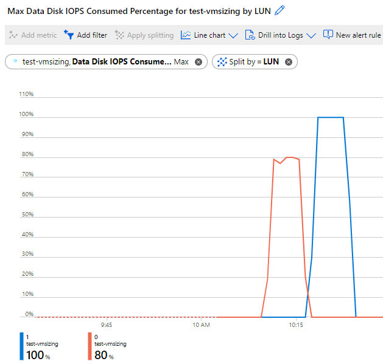

### Data Disk Throughput
We can also see our throughput metrics flatlining at their peak. In both cases we are not near the throughput limits. In this case our generated load was IOPS heavy but light on throughput.

This could be the first way performance issues are brought to your attention. Seeing a flatline at 8% consumed bandwidth may be confusing but keep in mind there are other limits you may be hitting.

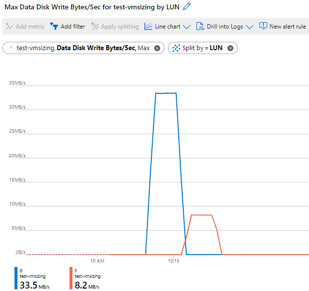

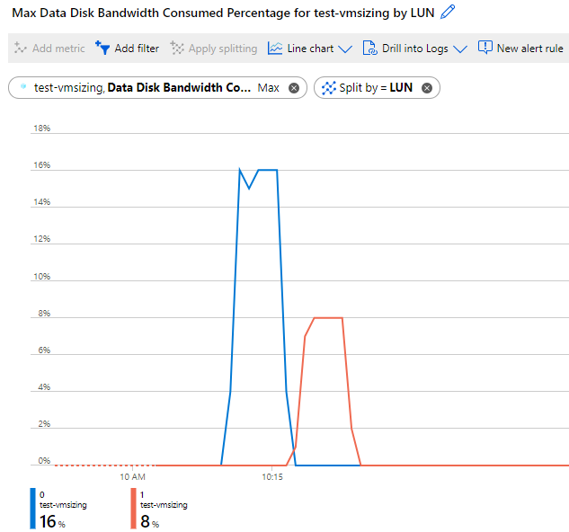

### Queue Depth
Data Disk Queue Depth is "The number of current outstanding IO requests that are waiting to be read from or written to the data disk(s)." In this example the queue depth is spiking which means IO requests are waiting around. Depending on the queue depth, this could be impacting your application performance. The flatlining at the tops would also be concerning as it could indicate throttling.

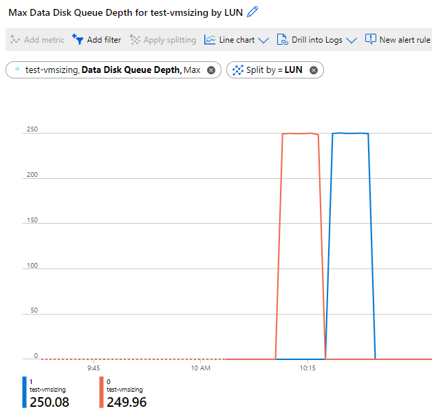

### Dashboards
The ability to browse the available metrics is great but you may have a few that you want to monitor on a regular basis. You can pin these metrics to a custom dashboard that you can create specifically for your application. In this example I have created a dashboard to pin the four metrics I used in this post.

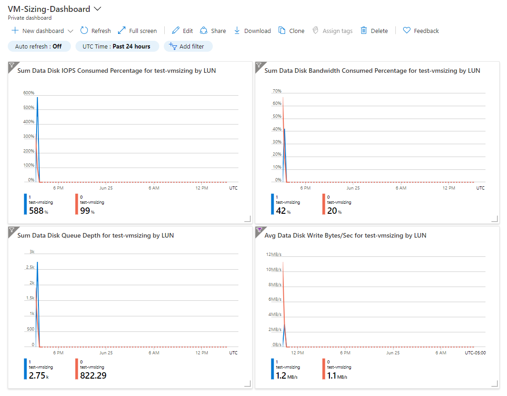

## Summary
Azure Virtual Machines come in families, or series, which offer different performance capabilities. Choosing the appropriate VM SKU is only one part of properly sizing a VM. The Virtual Machines and their Managed Disks have separate storage performance limits.  When deploying a new system you should:
 * Evaluate your IOPS/Throughput requirements against Virtual Machine storage limits
 * Evaluate your IOPS/Throughput requirements against Managed Disk storage limits
 * Use Azure Monitor to assess App/VM performance and validate sizing is appropriate for production
 * Consider creating a custom dashboard to monitor a specific VM or environment

There are many other considerations when sizing a VM in Azure. I couldn't address all of them in this post. I decided to focus on the VM/Disk level limits because they can cause the most pain if you get that wrong.

I recommend the video below if you would like a broader overview of VM sizing. 

* [John Savill (CSA) - Azure VM Size Overview](https://youtu.be/10FQkdAuNR0)

Lastly, there is application specific performance documentation that can help further optimize your environment.
 * [Best practices for SQL Server on Azure VMs](https://docs.microsoft.com/en-us/azure/azure-sql/virtual-machines/windows/performance-guidelines-best-practices-checklist)
 * [SAP HANA infrastructure configurations and operations on Azure](https://docs.microsoft.com/en-us/azure/virtual-machines/workloads/sap/hana-vm-operations)
 * [Design and implement an Oracle database in Azure](https://docs.microsoft.com/en-us/azure/virtual-machines/workloads/oracle/oracle-design)

## Supporting docs
Here is a list of the Azure Docs I leveraged while creating the post. The diagrams in the post were recreated (for clarity and continuity) based on the original diagrams in the docs.
* [Azure Disk Storage overview - Azure Virtual Machines | Microsoft Docs](https://docs.microsoft.com/en-us/azure/virtual-machines/managed-disks-overview)
* [VM sizes - Azure Virtual Machines | Microsoft Docs](https://docs.microsoft.com/en-us/azure/virtual-machines/sizes)
* [Select a disk type for Azure IaaS VMs - managed disks - Azure Virtual Machines | Microsoft Docs](https://docs.microsoft.com/en-us/azure/virtual-machines/disks-types)
* [Virtual machine and disk performance - Azure Virtual Machines | Microsoft Docs](https://docs.microsoft.com/en-us/azure/virtual-machines/disks-performance)